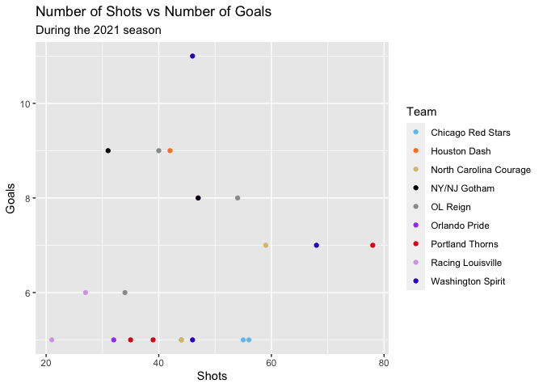
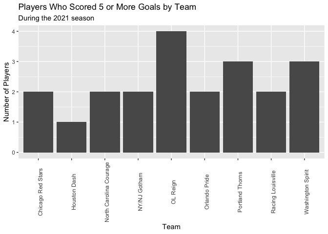

National Women’s Soccer League Goal Scorers
================

## About the Data

This data includes players who scored 5 or more goals during the 2021
season, which runs from May to November. There are 21 players who scored
5 or more goals. [1]

## Shots vs Goals by Player

This plot shows the number of shots taken by each of the NWSL players
who scored 5 or more goals during the 2021 season. Players who scored
more goals while taking less shots were more effective at converting
their opportunities.

``` r
ggplot(data = stats, mapping = aes(x = shots, y = goals_scored, color = team)) + 
  geom_point() + 
  scale_color_manual(values = c("#6CC5F5", "#FF842A", "#DDC27B", "black", "#9E9B9B", "#A54BF1", "#E51A1A", "#D7A8E7", "#3324CA")) +
  labs(title = "Number of Shots vs Number of Goals", subtitle = 
         "During the 2021 season", x = "Shots", y = "Goals", color = "Team")
```

<!-- -->

## Teams with Most Top Scorers

This plot shows the distribution across teams of the players who scored
5 or more goals in the 2021 season

``` r
ggplot(data = stats, mapping = aes(x = team)) + 
  geom_bar() +
  theme(axis.text.x = element_text(angle = 90)) +
  labs(title = "Players Who Scored 5 or More Goals by Team", subtitle = 
         "During the 2021 season", x = "Team", y = "Number of Players")
```

<!-- -->

[1] <https://www.nwslsoccer.com/stats/players>
